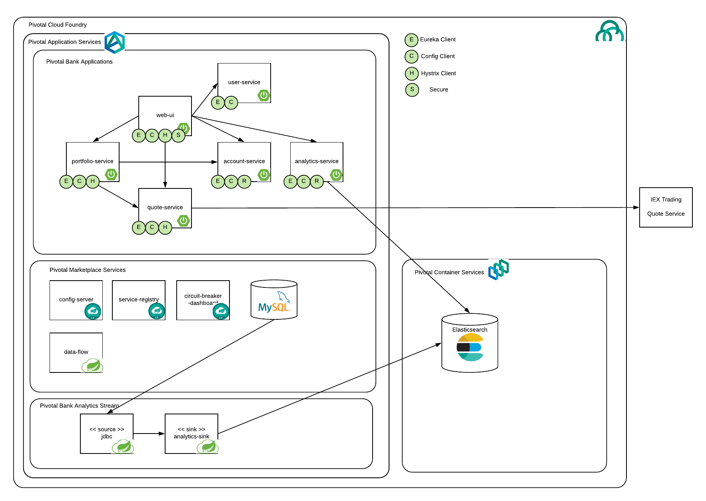

# Pivotal Bank Analytics

Pivotal Bank Analytics is an extension to pivotal bank that incorporates [elasticsearch](https://www.elastic.co/) 
deployed to [Pivotal Container Service](https://pivotal.io/platform/pivotal-container-service) and 
[Spring Cloud Data Flow for PCF](https://docs.pivotal.io/scdf/1-1/).  It offloads potentially expensive queries from
the transactional database source and to elasticsearch.

The demo includes the following: 

- **Enterprise Microservices**. The venerable Pivotal Bank demo highlights the use of Spring Cloud and Spring Cloud Services deliver enterprise class micro-services capabilities.

- **Stateful Data Services on PKS**. Deploy Elasticsearch on PKS leveraging persistent storage and privileged containers.

- **ETL leveraging Spring Cloud Data Flow**. Spring Cloud Data Flow for PCF replicates data from MySQL to Elasticsearch using jdbc source and custom Elasticsearch sink.

- **New microservice**. Extends Pivotal Bank, through creation of new microservice and updated UI.

Have a look at the updated architecture.  



> Requires that you have access to Pivotal Container Service.

# Demo Setup Background

The instructions below should be followed as preparation for light weight demo.  
Or if you want to learn the specifics from soup to nuts.  Once completed, you can access
these instructions for a shorter demo that relies on these prerequistes.

# Demo Setup Steps

> Assumes you have already logged in to pks and cf via the command line and pivotal-bank is already deployed

1. Setup elasticsearch (must be 5.6.4)

Create elasticsearch cluster
```
kubectl apply -f vsphere-volume-sc-fast.yaml
kubectl create namespace es-demo
kubectl config set-context my-cluster --namespace=es-demo
kubectl apply -f es-statefulset.yaml
kubectl apply -f es-svc.yaml
```
2. Get service details
```
kubectl get nodes -o wide
kubectl get svc
```

If your PKS instance is not setup with NSX-T you will need to use the NodePort to access the service.
```
export ES_HOST=$(kubectl get node  -o 'jsonpath={.items[0].status.addresses[0].address}')
export ES_PORT=$(kubectl get svc elasticsearch -o 'jsonpath={.spec.ports[?(@.port==9300)].nodePort}')
export ES_HTTP_PORT=$(kubectl get svc elasticsearch -o 'jsonpath={.spec.ports[?(@.port==9200)].nodePort}')
```

Otherwise, the LoadBalancer service should be given and external ip and you can follow these commands.
```
export ES_HOST=$(kubectl get svc elasticsearch -o 'jsonpath={.status.loadBalancer.ingress[0].ip}')
export ES_PORT=9300
export ES_HTTP_PORT=9200
```

3. Test elasticsearch cluster
```
http $ES_HOST:$ES_HTTP_PORT
http POST $ES_HOST:$ES_HTTP_PORT/trader/trades symbol=PVTL
http $ES_HOST:$ES_HTTP_PORT/trader/_search
```

4. Create CUPS for use by analytics-service
```
cf create-user-provided-service es -p "'{\"cluster-name\":\"elasticsearch\",\"host\":\"$ES_HOST\",\"port\":\"$ES_PORT\"}'"
```

5. Build and push the analytics-service

>You need to pass in the elasticsearch host and port or the tests will fail.

```
VCAP_SERVICES_ES_CREDENTIALS_HOST=$ES_HOST \
VCAP_SERVICES_ES_CREDENTIALS_PORT=$ES_PORT \
./gradlew build

cf push
```

6. Build and deploy analytics-scdf-sink to [bintray](www.bintray.com) or alternative maven repository
>You need to pass in the elasticsearch host and port or the tests will fail.
>Also specify the properties for maven distribution management repository id and url.  For example, ...release.id=bintray 
and ....release.url=https://api.bintray.com/maven/dpfeffer/maven-repo/analytics-scdf-sink
```
ES_SINK_HOST=$ES_HOST \
ES_SINK_PORT=$ES_PORT \
mvn clean deploy -Ddistribution.management.release.id=<repository_id> -Ddistribution.management.release.url=<repository url>
```

> Ensure that you **publish** the version that is deployed so that it is publicly accessible

7. SCDF Command Prep

Get the traderdb connection information
```
cf env user
```
Set environment variables
```
export DB_HOST=10.193.213.234
export DB_USERNAME=9e0aaf43b46d47a1ab0eb56ab4ce2f0b
export DB_PASSWORD=8cuxtpq6bwmzw1k
```

Export your bintray credentials
```
export BINTRAY_USERNAME=<your_bintray_username>
```

Export analytics-scdf-sink version from your analytics-scdf-sink pom file.  Something like 1.1.4
```
export ANALYTICS_SCDF_SINK_VERSION=<your_version>
```

Resolve data flow shell commands.

```
echo "app register --name analytics-scdf-sink --type sink --uri maven://io.pivotal.analytics:analytics-scdf-sink:$ANALYTICS_SCDF_SINK_VERSION"
```
Copy the output and put in a scratch pad for use later.

```
echo "stream create --name trader --definition \"jdbc --query='select * from orders where tag is NULL' --update='update orders set tag=''1'' where orderid in (:orderid)' --password=$DB_PASSWORD --username=$DB_USERNAME --url='jdbc:mysql://$DB_HOST:3306/service_instance_db' --spring.datasource.driver-class-name=org.mariadb.jdbc.Driver | analytics-scdf-sink --es-sink.cluster-name=elasticsearch --es-sink.host=$ES_HOST --es-sink.port=$ES_PORT\""
```
Copy the output and put in a scratch pad for use later.

```
echo "cf create-service p-dataflow standard data-flow -c '{\"maven.remote-repositories.repo1.url\": \"https://dl.bintray.com/$BINTRAY_USERNAME/maven-repo\"}'"
```
Copy the output and put in a scratch pad for use later.

8. Setup SCDF

Use the resolved `cf create-service` command from above

>This step may take several minutes.  Use `watch cf services` to monitor the status of the creation

9. Access the dataflow shell
```
cf dataflow-shell data-flow
```

10. Import the starters
```
app import http://bit.ly/Darwin-SR1-stream-applications-rabbit-maven
```

11. Register the analytics-scdf-sink

Use the resolved `app register` command from above

Test out that the registration was successful.

```
app info sink:analytics-scdf-sink
```

12. Create the trader stream

Use the resolved `stream create` command from above

13. Deploy stream

```
stream deploy trader
```

14. Run your test
Make a trade, then view the analytics

15. Un-deploy and un-register SCDF

Within the dataflow shell

```
stream undeploy trader
stream destroy trader
```

16. Tear Down elasticsearch
```
kubectl delete -f es-statefulset.yaml
kubectl delete -f es-svc.yaml
```

# Demo Time

Now with the above in place you are ready for the demo.  The following is a shortened version that already assumes that you have
- Created the SCDF service
- analytics-scdf-sink is already deployed to bintray
- starter apps are already registered in data-flow service
- analytics-scdf-sink is already registered in data-flow service
- analytics-service is already deployed
- es user-provided service already created
- vsphere storage class already exists in cluster
- Following environment variables are already setup
    - DB_HOST
    - DB_USERNAME
    - DB_PASSWORD
    - BINTRAY_USERNAME 
    - ANALYTICS_SCDF_SINK_VERSION

> Assumes you have already logged in to pks and cf via the command line and pivotal-bank is already deployed

1. Setup elasticsearch (must be 5.6.4)

Create elasticsearch cluster
```
kubectl config set-context my-cluster --namespace=es-demo
kubectl apply -f es-statefulset.yaml
kubectl apply -f es-svc.yaml
```
2. Get service details
```
kubectl get nodes -o wide
kubectl get svc
```

If your PKS instance is not setup with NSX-T you will need to use the NodePort to access the service.
```
export ES_HOST=$(kubectl get node  -o 'jsonpath={.items[0].status.addresses[0].address}')
export ES_PORT=$(kubectl get svc elasticsearch -o 'jsonpath={.spec.ports[?(@.port==9300)].nodePort}')
export ES_HTTP_PORT=$(kubectl get svc elasticsearch -o 'jsonpath={.spec.ports[?(@.port==9200)].nodePort}')
```

Otherwise, the LoadBalancer service should be given and external ip and you can follow these commands.
```
export ES_HOST=$(kubectl get svc elasticsearch -o 'jsonpath={.status.loadBalancer.ingress[0].ip}')
export ES_PORT=9300
export ES_HTTP_PORT=9200
```

3. Test elasticsearch cluster
```
http $ES_HOST:$ES_HTTP_PORT
http POST $ES_HOST:$ES_HTTP_PORT/trader/trades symbol=PVTL
http $ES_HOST:$ES_HTTP_PORT/trader/_search
```

4. Update CUPS for use by analytics-service
```
cf update-user-provided-service es -p "'{\"cluster-name\":\"elasticsearch\",\"host\":\"$ES_HOST\",\"port\":\"$ES_PORT\"}'"
```

5. Restage the analytics-service

>You need to pass in the elasticsearch host and port or the tests will fail.

```
cf restage analytics
```

6. SCDF Command Prep

Copy the output and put in a scratch pad for use later.

```
echo "stream create --name trader --definition \"jdbc --query='select * from orders where tag is NULL' --update='update orders set tag=''1'' where orderid in (:orderid)' --password=$DB_PASSWORD --username=$DB_USERNAME --url='jdbc:mysql://$DB_HOST:3306/service_instance_db' --spring.datasource.driver-class-name=org.mariadb.jdbc.Driver | analytics-scdf-sink --es-sink.cluster-name=elasticsearch --es-sink.host=$ES_HOST --es-sink.port=$ES_PORT\""
```

7. Access the dataflow shell
```
cf dataflow-shell data-flow
```

8. Create the trader stream

Use the resolved `stream create` command from above

9. Deploy stream

```
stream deploy trader
```

10. Run your test
Make a trade, then view the analytics

# Demo Soft Clean Up so It can be Re-run

1. Un-deploy and un-register SCDF

Within the dataflow shell

```
stream undeploy trader
stream destroy trader
```

2. Tear Down elasticsearch
```
kubectl delete -f es-statefulset.yaml
kubectl delete -f es-svc.yaml
```